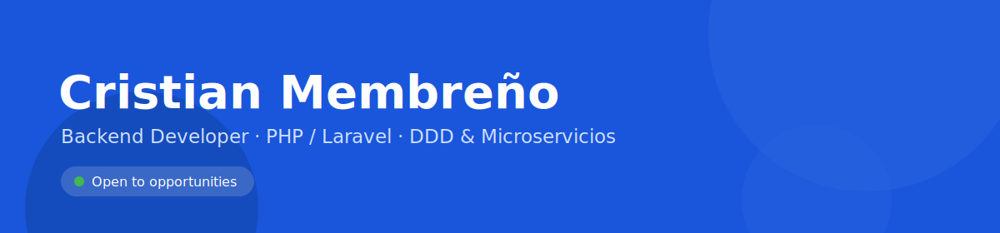

  

  Desarrollador backend con 6 años de experiencia en el sector asegurador (<b>InsurTech</b>). 
  Construyo sistemas escalables con <b>Laravel</b>, arquitectura <b>DDD / hexagonal</b>, microservicios y procesamiento asíncrono. 
  También desarrollo apps móviles, desktop y herramientas con IA.

 

## Stack técnico

<table>
  <tr>
    <td><b>Backend</b></td>
    <td>
      
      
      
      
    </td>
  </tr>
  <tr>
    <td><b>Datos</b></td>
    <td>
      
      
      
    </td>
  </tr>
  <tr>
    <td><b>DevOps</b></td>
    <td>
      
      
      
      
    </td>
  </tr>
  <tr>
    <td><b>Otros</b></td>
    <td>
      
      
      
      
    </td>
  </tr>
</table>

## Proyectos destacados

**LocalPDF** &nbsp; 
App de escaneo de documentos a PDF. Generación nativa en Dart. 
<a href="https://drive.google.com/uc?export=download&id=14ns4T0a3FesMUoaWeN9cvKkO-J5G4Ghz" target="_blank" rel="noopener noreferrer"><b>Descargar para Android</b></a> · iOS y Web próximamente

**iris-capture** &nbsp; 
Transcripción de audio en tiempo real. Arquitectura híbrida, WebSockets. 

**vrhouse** &nbsp; 
Reconstrucción 3D / Gaussian Splatting. PyTorch, CUDA, optimización GPU. 

## Contacto

  
  
  

## Webs en las que he participado

> Proyectos desarrollados completos o con contribución destacada.

<table>
  <tbody>
    <tr>
      <td><a href="https://www.agrobimer.es/" target="_blank" rel="noopener noreferrer">Agrobimer</a></td>
      <td><a href="https://www.broncesriopar.es/" target="_blank" rel="noopener noreferrer">Bronces Riopar</a></td>
      <td><a href="https://nosotras.app/" target="_blank" rel="noopener noreferrer">Nosotras</a></td>
    </tr>
    <tr>
      <td><a href="https://scudea.es/" target="_blank" rel="noopener noreferrer">Scudea</a></td>
      <td><a href="https://gelbia.com/" target="_blank" rel="noopener noreferrer">Gelbia</a></td>
      <td><a href="https://www.topllaves.com/" target="_blank" rel="noopener noreferrer">Top Llaves</a></td>
    </tr>
    <tr>
      <td><a href="https://www.casaruralyeste.es/" target="_blank" rel="noopener noreferrer">Casa Rural Yeste</a></td>
      <td><a href="https://www.taxmanconsultores.es/" target="_blank" rel="noopener noreferrer">Taxman Consultores</a></td>
      <td><a href="https://clinicadentalsotocapagan.es/" target="_blank" rel="noopener noreferrer">Clínica Dental Soto Capagán</a></td>
    </tr>
    <tr>
      <td><a href="https://infinitybrokershn.com/" target="_blank" rel="noopener noreferrer">Infinity Brokers</a></td>
      <td><a href="https://www.galeriaenmanuel.com/" target="_blank" rel="noopener noreferrer">Galería Enmanuel</a></td>
      <td><a href="https://www.sunachi.es/" target="_blank" rel="noopener noreferrer">Sunachi</a></td>
    </tr>
    <tr>
      <td><a href="https://tecne.dev/" target="_blank" rel="noopener noreferrer">tecne.dev</a></td>
      <td></td>
      <td></td>
    </tr>
  </tbody>
</table>
